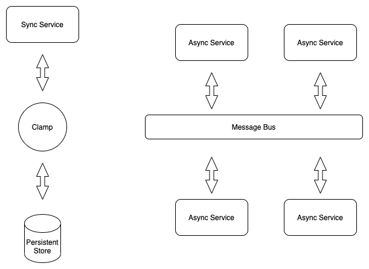

> An opinionated approach to microservices architecture and orchestration

# Introduction
Clamp lets you stitch together services in your distributed platform. Built primarily as a microservices orchestrator, it serves to cut down on boilerplate and decomposes complexities related to inter-service communication. Define workflows that seamlessly route to your services over both synchronous and asynchronous communication calls.

## Battle-tested design

 - Approach used on multiple platforms in production.
 - Seamless orchestration at scale
 - Facilitates workflow management
 - Central tracking of flows

## Batteries included

**Lightweight JSON-based workflow management**
Define and update workflows even at run-time, using our APIs.

**Simple payload transformation between steps** Use context variables such as past request and response content to create service payloads. Currently only support JSON payloads.

**Branching and conditional logic in workflows** Simplicity keeps business logic out and provides required flexibility to introduce multiple execution paths for scenarios such as error-handling and rollback.

**Sync and Async** Clamp supports both synchronous and asynchronous communication protocols for services, and ships with integrations for RabbitMQ, Kafka and HTTP.

**Request profiling and time distribution** Know exactly which steps are taking time, with in-built profiling and time distribution metrics, connect your own monitoring systems, and much more!

**Simple stateless design backed by a persistent store** Clamp can scale and manage high-throughput scenarios with minimal overhead.

To know the benefits of microservices orchestration [click here](https://searchapparchitecture.techtarget.com/tip/Learn-the-benefits-of-microservices-orchestration).